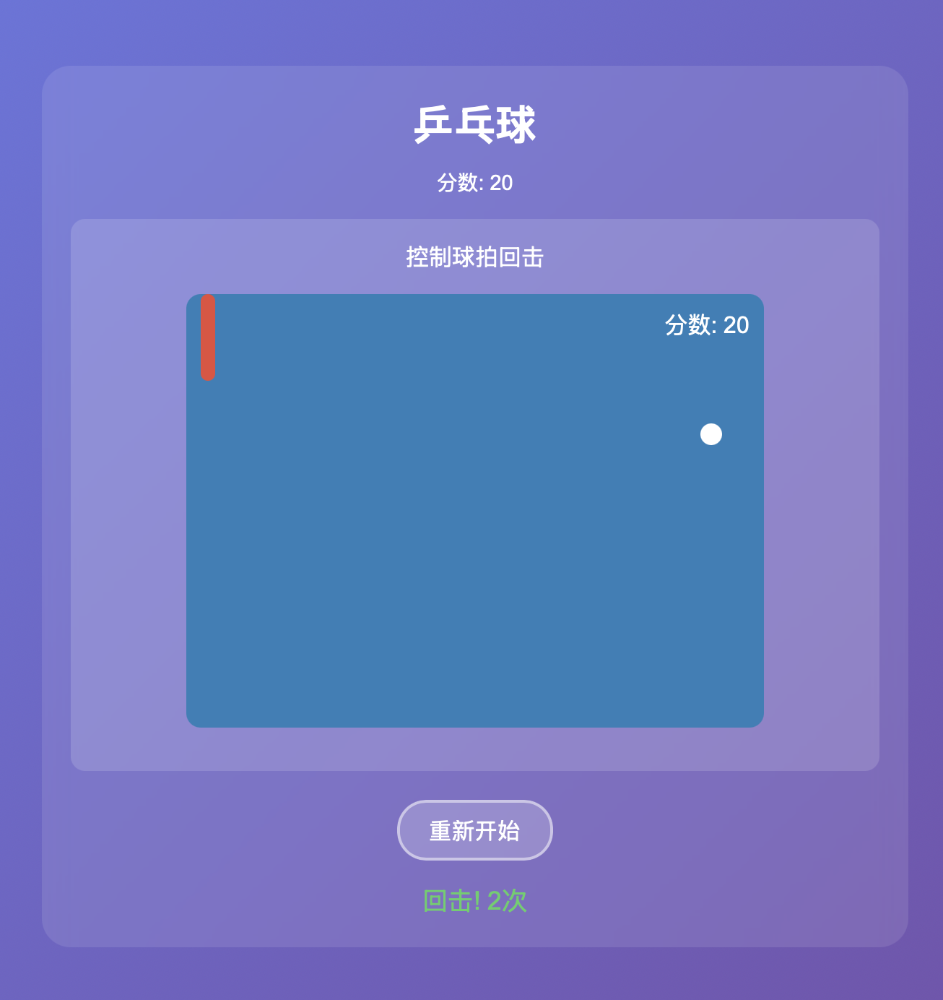

# 100个JavaScript小游戏 🎮

一个包含100个极简JavaScript小游戏的集合。每个游戏都是独立的HTML文件，可以直接在浏览器中运行，无需安装任何依赖。

## 🎯 项目特色

- **100个独立游戏** - 每个游戏都是一个完整的HTML文件
- **即开即玩** - 无需安装，双击即可运行
- **响应式设计** - 支持桌面端和移动端
- **本地存储** - 自动保存最高分记录
- **纯原生实现** - 无框架依赖，适合学习

## 📸 游戏截图预览

### 主页面


打开 `index.html` 即可浏览所有游戏，支持按分类筛选（益智解谜/纸牌棋盘/动作射击）。

### 🏀 真实游戏截图
以下为改进后的球类游戏真实截图，点击图片可直接体验游戏。

#### 射箭游戏 (game-055)
[](game-055/index.html)
*拖拽瞄准，释放射箭，体验真实弓箭物理*

#### 乒乓球游戏 (game-060)
[](game-060/index.html)
*控制球拍回击，球速逐渐增加*

#### 篮球游戏 (game-063)
[](game-063/index.html)
*拖拽投篮，体验抛物线物理效果*

#### 足球游戏 (game-062)
[](game-062/index.html)
*拖拽射门，守门员会自动扑救*

#### 保龄球游戏 (game-057)
[](game-057/index.html)
*点击投球，击倒球瓶得分*

---

*更多球类游戏截图正在添加中...*

### 🧩 益智解谜类游戏

#### 2048 - 数字合并游戏
```
┌─────────────────────────────┐
│                             │
│   ┌────┬────┬────┬────┐    │
│   │  2 │  4 │    │  2 │    │
│   ├────┼────┼────┼────┤    │
│   │    │  2 │  4 │    │    │
│   ├────┼────┼────┼────┤    │
│   │  2 │    │  2 │  4 │    │
│   ├────┼────┼────┼────┤    │
│   │    │  2 │    │    │    │
│   └────┴────┴────┴────┘    │
│                             │
│   分数: 128  |  最高分: 512 │
└─────────────────────────────┘
```

#### 数独 - 经典数独游戏
```
┌─────────────────────────┐
│  5  3  . │ .  7  . │ . . . │
│  6  .  . │ 1  9  5 │ . . . │
│  .  9  8 │ .  .  . │ . 6 . │
├──────────┼─────────┼───────┤
│  8  .  . │ .  6  . │ . . 3 │
│  4  .  . │ 8  .  3 │ . . 1 │
│  7  .  . │ .  2  . │ . . 6 │
├──────────┼─────────┼───────┤
│  .  6  . │ .  .  . │ 2 8 . │
│  .  .  . │ 4  1  9 │ . . 5 │
│  .  .  . │ .  8  . │ . 7 9 │
└─────────────────────────┘
```

#### 扫雷 - 经典扫雷游戏
```
┌──────────────────────────────┐
│  💣  ·   ·   ·   1   ·   ·  │
│   ·   1   1   1   ·   1   1  │
│   ·   ·   ·   ·   ·   ·   ·  │
│   1   1   ·   1   1   ·   1  │
│  🚩  ·   ·   ·   ·   ·  💣  │
└──────────────────────────────┘
        时间: 00:45 | 得分: 10
```

#### 记忆翻牌 - 配对卡片
```
┌────────────────────────────┐
│                            │
│   🍎  🍌  🍇  🍊  🍋  🍓  │
│                            │
│   🍒  🥝  🍑  🥭  🍍  🥥  │
│                            │
│   🍎  🍌  🍇  🍊  🍋  🍓  │
│                            │
│   🍒  🥝  🍑  🥭  🍍  🥥  │
│                            │
│   配对: 0/12 | 尝试: 5     │
└────────────────────────────┘
```

#### 序列预测 - 找出规律
```
┌────────────────────────────┐
│                            │
│      2 → 4 → 6 → 8 → ?    │
│                            │
│        ┌─────────┐        │
│        │    ?    │        │
│        └─────────┘        │
│                            │
│         [  提交  ]         │
│                            │
│      规律: 等差 +2         │
└────────────────────────────┘
```

---

### ♟️ 纸牌棋盘类游戏

#### 五子棋 - 15x15 棋盘
```
┌──────────────────────────────┐
│  ·  ·  ·  ·  ·  ·  ·  ·  ·  │
│  ·  ·  ·  ·  ⚫  ·  ·  ·  ·  │
│  ·  ·  ·  ⚫  ⚪  ·  ·  ·  ·  │
│  ·  ·  ⚫  ⚪  ⚫  ⚪  ·  ·  ·  │
│  ·  ·  ·  ⚪  ⚫  ·  ·  ·  ·  │
│  ·  ·  ·  ·  ⚪  ·  ·  ·  ·  │
│  ·  ·  ·  ·  ·  ·  ·  ·  ·  │
└──────────────────────────────┘
        黑方回合 | 得分: 50
```

#### 黑白棋 - Reversi
```
┌────────────────────────────┐
│                            │
│   ⚪  ⚫  ⚪  ⚫  ⚪  ⚫  ⚪  │
│   ⚫  ⚪  ⚫  ⚪  ⚫  ⚪  ⚫  │
│   ⚪  ⚫  ⚪  ⚫  ⚪  ⚫  ⚪  │
│   ⚫  ⚪  ⚫  ⚪  ⚫  ⚪  ⚫  │
│   ⚪  ⚫  ⚪  ⚫  ⚪  ⚫  ⚪  │
│   ⚫  ⚪  ⚫  ⚪  ⚫  ⚪  ⚫  │
│                            │
│   黑: 12 | 白: 12          │
└────────────────────────────┘
```

#### 国际象棋 - 简化版
```
┌────────────────────────────┐
│  ♜  ♞  ♝  ♛  ♚  ♝  ♞  ♜  │
│  ♟  ♟  ♟  ♟  ♟  ♟  ♟  ♟  │
│   ·   ·   ·   ·   ·   ·   │
│   ·   ·   ·   ·   ·   ·   │
│   ·   ·   ·   ·   ·   ·   │
│   ·   ·   ·   ·   ·   ·   │
│  ♙  ♙  ♙  ♙  ♙  ♙  ♙  ♙  │
│  ♖  ♘  ♗  ♕  ♔  ♗  ♘  ♖  │
└────────────────────────────┘
        白方回合
```

#### 老虎机 - 拉杆赢奖
```
┌────────────────────────────┐
│                            │
│   ┌──────┬──────┬──────┐  │
│   │  🍒  │  🍋  │  🍊  │  │
│   └──────┴──────┴──────┘  │
│                            │
│        [  拉杆  ]         │
│                            │
│   ┌──────┬──────┬──────┐  │
│   │  🍒  │  🍒  │  🍒  │  │
│   └──────┴──────┴──────┘  │
│                            │
│        🎰 大奖! +100       │
└────────────────────────────┘
```

#### 骰子游戏 - 掷骰子
```
┌────────────────────────────┐
│                            │
│   ┌─────────┬─────────┐   │
│   │         │         │   │
│   │    ⚂    │    ⚄    │   │
│   │         │         │   │
│   └─────────┴─────────┘   │
│                            │
│        [ 掷骰子 ]         │
│                            │
│       左边: 3 | 右边: 5   │
│          右边大!           │
└────────────────────────────┘
```

---

### 🎯 动作射击类游戏

#### 贪吃蛇 - 经典贪吃蛇
```
┌────────────────────────────┐
│                            │
│         🍎                 │
│                            │
│   ████████                 │
│          █                 │
│          █                 │
│                            │
│                    ⭐      │
│                            │
└────────────────────────────┘
  分数: 30 | 最高分: 150
  [↑][↓][←][→] 移动  [空格] 加速
```

#### 俄罗斯方块 - Tetris
```
┌────────────────────┐
│                    │
│                    │
│                    │
│                    │
│                    │
│         ██         │
│         ██         │
│     ████████       │
│     ████████       │
│   ████████████     │
│   ████████████     │
└────────────────────┘
  分数: 1280 | 等级: 3
```

#### 打砖块 - Breakout
```
┌────────────────────────────┐
│  ████  ████  ████  ████    │
│  ████  ████  ████  ████    │
│  ████  ████  ████  ████    │
│  ████  ████  ████  ████    │
│                            │
│                            │
│              ⚪             │
│                            │
│          ▓▓▓▓▓▓▓▓          │
└────────────────────────────┘
  生命: 3 | 分数: 150
```

#### 太空侵略者 - Space Invaders
```
┌────────────────────────────┐
│                            │
│   👾  👾  👾  👾  👾  👾   │
│   👾  👾  👾  👾  👾  👾   │
│   👾  👾  👾  👾  👾  👾   │
│                            │
│           💥               │
│                            │
│           🚀               │
└────────────────────────────┘
  分数: 250 | 波数: 3
```

#### 小行星 - Asteroids
```
┌────────────────────────────┐
│  ☄️                    ☄️  │
│         ☄️                 │
│                 ☄️         │
│    ☄️            💥        │
│                  ◇         │
│         ☄️     ◇ ◇ ◇      │
│                           │
│  ☄️                       │
└────────────────────────────┘
  生命: 3 | 等级: 2 | 分数: 450
```

#### 月球登陆 - 安全着陆
```
┌────────────────────────────┐
│  燃料: 78%                 │
│  速度: 12.5 m/s            │
│  高度: 156m                │
│                            │
│           🚀               │
│          /|\               │
│         / | \              │
│                            │
│  ▓▓▓▓▓▓▓▓▓▓▓▓▓▓▓▓▓▓▓▓▓▓  │
│  ▓▓▓▓[  H  ]▓▓▓▓▓▓▓▓▓▓▓  │
└────────────────────────────┘
  [↑] 推进  [←][→] 平移
```

---

## 📁 项目结构

```
100-javascript-games/
├── index.html              # 主页面（游戏列表）
├── README.md               # 项目说明
├── game-001/               # 点击计数器
│   └── index.html
├── game-002/               # 猜数字
│   └── index.html
├── game-003/               # 记忆翻牌
│   └── index.html
├── game-004/               # 2048
│   └── index.html
├── game-005/               # 数独
│   └── index.html
├── ...
├── game-071/               # 贪吃蛇
│   └── index.html
├── game-072/               # 俄罗斯方块
│   └── index.html
└── game-100/               # 宇宙战争
    └── index.html
```

## 🎮 完整游戏列表

### 🧩 益智解谜类 (35个)

| 编号 | 游戏名称 | 说明 | 难度 |
|------|----------|------|------|
| 001 | 点击计数器 | 5秒内点击最多次数 | ⭐ |
| 002 | 猜数字 | 1-100猜数字 | ⭐ |
| 003 | 记忆翻牌 | 配对卡片 | ⭐⭐ |
| 004 | 2048 | 数字合并游戏 | ⭐⭐⭐ |
| 005 | 数独 | 简化版数独 | ⭐⭐⭐ |
| 006 | 滑块拼图 | 15拼图 | ⭐⭐ |
| 007 | 连连看 | 图案配对 | ⭐⭐ |
| 008 | 找不同 | 两图对比 | ⭐ |
| 009 | 汉诺塔 | 经典递归游戏 | ⭐⭐⭐ |
| 010 | 华容道 | 滑块解谜 | ⭐⭐⭐ |
| 011 | 数织谜题 | Picross简化版 | ⭐⭐⭐ |
| 012 | 填字游戏 | 简单填字 | ⭐⭐ |
| 013 | 扫雷 | 经典扫雷 | ⭐⭐⭐ |
| 014 | 迷宫生成 | 随机迷宫 | ⭐⭐ |
| 015 | 逻辑门电路 | 基础逻辑 | ⭐⭐ |
| 016 | 数字推理 | 数学推理 | ⭐⭐ |
| 017 | 图形匹配 | 图形识别 | ⭐ |
| 018 | 颜色混合 | RGB混合 | ⭐⭐ |
| 019 | 方向判断 | 空间方向 | ⭐ |
| 020 | 序列预测 | 数列规律 | ⭐⭐ |
| 021 | 模式识别 | 图案模式 | ⭐⭐ |
| 022 | 空间旋转 | 3D旋转 | ⭐⭐ |
| 023 | 镜像对称 | 对称判断 | ⭐ |
| 024 | 路径规划 | 最短路径 | ⭐⭐⭐ |
| 025 | 物品分类 | 分类游戏 | ⭐ |
| 026 | 大小比较 | 数字比较 | ⭐ |
| 027 | 时间计算 | 时间差 | ⭐⭐ |
| 028 | 距离估算 | 距离判断 | ⭐⭐ |
| 029 | 角度测量 | 角度估算 | ⭐⭐ |
| 030 | 面积计算 | 面积估算 | ⭐⭐ |
| 031 | 体积估算 | 3D体积 | ⭐⭐ |
| 032 | 重量平衡 | 天平游戏 | ⭐ |
| 033 | 速度控制 | 速度调节 | ⭐⭐ |
| 034 | 加速度模拟 | 物理模拟 | ⭐⭐ |
| 035 | 重力感应 | 重力游戏 | ⭐⭐ |

### ♟️ 纸牌棋盘类 (35个)

| 编号 | 游戏名称 | 说明 | 难度 |
|------|----------|------|------|
| 036 | 井字棋 | 经典Tic-Tac-Toe | ⭐ |
| 037 | 五子棋 | 连五子获胜 | ⭐⭐ |
| 038 | 四子棋 | 连四子获胜 | ⭐⭐ |
| 039 | 黑白棋 | Reversi | ⭐⭐ |
| 040 | 跳棋 | Checkers简化版 | ⭐⭐⭐ |
| 041 | 国际象棋 | 象棋简化版 | ⭐⭐⭐ |
| 042 | 中国象棋 | 象棋简化版 | ⭐⭐⭐ |
| 043 | 扑克接龙 | Solitaire | ⭐⭐ |
| 044 | 纸牌记忆 | 记忆配对 | ⭐⭐ |
| 045 | 骰子游戏 | Yahtzee简化版 | ⭐ |
| 046 | 轮盘赌 | 轮盘游戏 | ⭐ |
| 047 | 老虎机 | 老虎机模拟 | ⭐ |
| 048 | 彩票刮刮乐 | 刮刮乐游戏 | ⭐ |
| 049 | 赛马游戏 | 赛马模拟 | ⭐ |
| 050 | 赛车游戏 | 赛车模拟 | ⭐⭐ |
| 051 | 钓鱼游戏 | 钓鱼模拟 | ⭐ |
| 052 | 打地鼠 | Whack-a-Mole | ⭐ |
| 053 | 套圈游戏 | 套圈模拟 | ⭐ |
| 054 | 投篮游戏 | 投篮模拟 | ⭐ |
| 055 | 射箭游戏 | 射箭模拟 | ⭐⭐ |
| 056 | 飞镖游戏 | 飞镖模拟 | ⭐⭐ |
| 057 | 保龄球 | 保龄球模拟 | ⭐ |
| 058 | 高尔夫 | 高尔夫简化版 | ⭐⭐ |
| 059 | 网球 | 网球简化版 | ⭐⭐ |
| 060 | 乒乓球 | 乒乓球模拟 | ⭐⭐ |
| 061 | 羽毛球 | 羽毛球模拟 | ⭐⭐ |
| 062 | 足球 | 足球简化版 | ⭐ |
| 063 | 篮球 | 篮球模拟 | ⭐ |
| 064 | 冰球 | 冰球模拟 | ⭐⭐ |
| 065 | 曲棍球 | 曲棍球模拟 | ⭐⭐ |
| 066 | 棒球 | 棒球模拟 | ⭐ |
| 067 | 橄榄球 | 橄榄球模拟 | ⭐ |
| 068 | 排球 | 排球模拟 | ⭐⭐ |
| 069 | 手球 | 手球模拟 | ⭐ |
| 070 | 水球 | 水球模拟 | ⭐ |

### 🎯 动作射击类 (30个)

| 编号 | 游戏名称 | 说明 | 难度 |
|------|----------|------|------|
| 071 | 贪吃蛇 | 经典贪吃蛇 | ⭐⭐ |
| 072 | 俄罗斯方块 | Tetris | ⭐⭐⭐ |
| 073 | 打砖块 | Breakout | ⭐⭐ |
| 074 | 太空侵略者 | Space Invaders | ⭐⭐⭐ |
| 075 | 飞机大战 | 飞机射击 | ⭐⭐ |
| 076 | 坦克大战 | 坦克射击 | ⭐⭐⭐ |
| 077 | 吃豆人 | Pac-Man简化版 | ⭐⭐ |
| 078 | 超级玛丽 | Mario简化版 | ⭐⭐ |
| 079 | 魂斗罗 | Contra简化版 | ⭐⭐⭐ |
| 080 | 彩虹岛 | Rainbow简化版 | ⭐⭐ |
| 081 | 冒险岛 | Adventure简化版 | ⭐⭐ |
| 082 | 忍者神龟 | TMNT简化版 | ⭐⭐ |
| 083 | 街头霸王 | Street Fighter简化版 | ⭐⭐⭐ |
| 084 | 拳皇 | King of Fighters简化版 | ⭐⭐⭐ |
| 085 | 侍魂 | Samurai简化版 | ⭐⭐⭐ |
| 086 | 合金弹头 | Metal Slug简化版 | ⭐⭐⭐ |
| 087 | 战场之狼 | Battle简化版 | ⭐⭐ |
| 088 | 1942 | 经典射击游戏 | ⭐⭐⭐ |
| 089 | 雷电 | Raiden简化版 | ⭐⭐⭐ |
| 090 | 沙罗曼蛇 | Salamander简化版 | ⭐⭐⭐ |
| 091 | 异形战机 | Alien简化版 | ⭐⭐⭐ |
| 092 | 铁板阵 | Xevious简化版 | ⭐⭐⭐ |
| 093 | 小蜜蜂 | Galaga简化版 | ⭐⭐ |
| 094 | 大蜜蜂 | Galaxian简化版 | ⭐⭐ |
| 095 | 小行星 | Asteroids | ⭐⭐⭐ |
| 096 | 陨石大战 | Meteor简化版 | ⭐⭐ |
| 097 | 月球登陆 | Moon Landing | ⭐⭐⭐ |
| 098 | 太阳系探险 | Solar简化版 | ⭐⭐ |
| 099 | 星际旅行 | Star简化版 | ⭐⭐ |
| 100 | 宇宙战争 | Space简化版 | ⭐⭐⭐ |

## 🚀 快速开始

### 方法一：直接运行
1. 下载或克隆本项目
2. 双击 `index.html` 文件
3. 选择游戏开始玩耍

### 方法二：本地服务器（推荐）
```bash
# 进入项目目录
cd 100-javascript-games

# 启动本地服务器（Python 3）
python3 -m http.server 8000

# 或使用 Node.js
npx http-server

# 打开浏览器访问 http://localhost:8000
```

### 方法三：GitHub Pages
访问在线演示：[https://build-your-own-x-with-ai.github.io/mimo-v2-pro-100-games/](https://build-your-own-x-with-ai.github.io/mimo-v2-pro-100-games/)

## 🎯 游戏操作

### 益智解谜类
- **鼠标点击** - 大部分操作
- **方向键** - 移动方块/角色
- **数字键** - 输入数字（数独等）

### 纸牌棋盘类
- **鼠标点击** - 选择和移动棋子
- **拖拽** - 部分游戏支持拖拽

### 动作射击类
- **← → 方向键** - 左右移动
- **↑ ↓ 方向键** - 上下移动（部分游戏）
- **空格键** - 射击/跳跃
- **触摸按钮** - 移动端虚拟按钮

## 🛠️ 技术栈

- **HTML5** - 页面结构
- **CSS3** - 样式和动画
- **JavaScript (ES6+)** - 游戏逻辑
- **Canvas API** - 图形渲染
- **LocalStorage** - 数据持久化

## 📱 浏览器支持

| 浏览器 | 最低版本 |
|--------|----------|
| Chrome | 60+ |
| Firefox | 55+ |
| Safari | 11+ |
| Edge | 79+ |
| Opera | 47+ |

## 🤝 贡献

欢迎提交 Issue 和 Pull Request！

### 如何贡献
1. Fork 本项目
2. 创建你的特性分支 (`git checkout -b feature/AmazingFeature`)
3. 提交你的修改 (`git commit -m 'Add some AmazingFeature'`)
4. 推送到分支 (`git push origin feature/AmazingFeature`)
5. 打开一个 Pull Request

## 📄 许可证

MIT License - 详见 [LICENSE](LICENSE) 文件

## 🔗 相关链接

- [项目仓库](https://github.com/build-your-own-x-with-ai/mimo-v2-pro-100-games)
- [问题反馈](https://github.com/build-your-own-x-with-ai/mimo-v2-pro-100-games/issues)
- [在线演示](https://build-your-own-x-with-ai.github.io/mimo-v2-pro-100-games/)

## ⭐ Star History

如果这个项目对你有帮助，请给个 Star ⭐

---

**享受游戏的乐趣！** 🎮✨